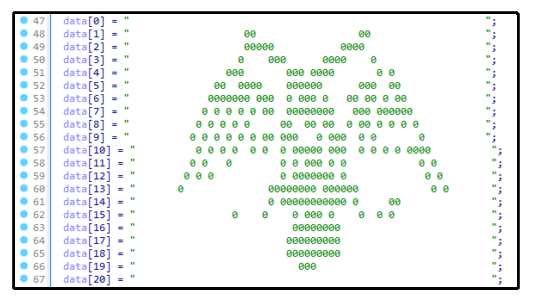

# Obfusheader.h
<div align=center style="background-color: transparent;">
</img>
</div>

Obfusheader.h is a header-only library for C++14 and above, offering features like compile-time obfuscation (string & decimal encryption, control flow, call hiding). It is self-contained, compatible with Windows and Unix, and supports g++, gcc, and Visual C++ compilers on various CPU architectures. This header simplifies adding basic protection to sensitive data in your binaries and supports g++ compilation arguments (-O3, Os, -fPIC, etc).

## ℹ️ Project goals

Unlike Windows x86_64 with VMProtect, Themida and other tools, on some platforms there's no good ways to protect your binaries, for example Arm64 / Arm32 android or linux ones. Because of that developing native ARM software (for example gaming mods) becomes a big problem - your product can be easily cracked by anyone. This gave me inspiration to create a handmade compile-time obfuscation using C++ macros, templates and constant expressions to provide basic protection measures for any platform, including android and Arm linux.

## 🛠️ Current features

<div align=center style="background-color: transparent;">
</img>
<text>Sample crackme with & without obfusheader.h</text>
</div>

### Obfuscation features
- Fully compile-time contant encryption (any types, including strings, decimals & chars) with two modes - threadlocal & normal and random key generation in compile-time)
- Call hiding (using compile-time function pointer array shuffling)
- Imports hiding (cross-platform via GetProcAddress on windows & dlsym on linux) with import name encryption
- if/else/while/for/switch compiletime branching mutation (inline control flow, branch redefinition)
- Purely compile-time random providers based on macro constants (\_\_TIME\_\_, \_\_LINE\_\_, \_\_COUNTER\_\_)
- Completely break decompiler such as IDA pro using unusual inline ASM blocks & indirect branching
- Watermarking & leaving fun messages for crackers in your binaries which will appear in decompiler and stack trace
- Fake signatures to trick DIE (Detect-It-Easy) and other detectors into thinking the binary is protected via VMProtect, Themida & other popular protectors

### Additional modules
- Fully inline internal implementation of common C methods such as strcmp, memcmp, strcmp, etc to avoid hooking & make reversing harder

## 📑 Usage

⚠️ Note that obfusheader doesn't use dynamic allocations. All the decryption happens in stack memory and the returned values will be deallocated whenever you leave the scope. If you want to use obfusheader with dynamic allocations then you should manually copy decrypted data from stack memory to dynamic memory using **strncpy** or **memcpy**.

### Settings
You can change them in the start of the header. This will affect how the obfuscation works in different ways. 

```c++
#pragma region CONFIG
    // C++ only features
    #define CONST_ENCRYPTION            1
    #define CONST_ENCRYPT_MODE          NORMAL // NORMAL & THREADLOCAL
    #define CFLOW_CONST_DECRYPTION      1
    // C & C++ features
    #define CFLOW_BRANCHING             1
    #define INDIRECT_BRANCHING          1
    #define FAKE_SIGNATURES             1
    #define INLINE_STD                  1
#pragma endregion CONFIG
```

### Compile-time constant encryption
You can encrypt strings and any xor-able decimals easily. The macro is universal - it accepts any supported type as an argument.
```c++
// Constant encryption
 printf("char*: %s\n"
        "int (dec): %d\n"
        "long long: %llu\n"
        "int (hex): 0x%x\n"
        "boolean: %d\n",
        OBF("test"), OBF(123),
        OBF(9223372036854775807),
        OBF(0x123), OBF(true));
```
The logic of the program won't be affected and the original values will be restored during runtime and **never present in the binary**.
<div align=center>
<br/>
<text>The logic isn't affected - the data is decrypted in runtime</text>
</div>
<br/>

### Binary watermarking
You can leave messages and ASCII arts in your binary which will not affect execution, but will be displayed in IDA/GHIDRA decompilers. To do that use the **WATERMARK** macro. This doesn't affect execution in any way - the feature is purely visual, just to mess with the crackers or leave some kind of message in the binary. It's made in special was so it won't be optimized away with any compiler flags/optimizations.

```c++
// Watermarking for IDA/Ghidra
WATERMARK("                                                           ",
          "                   00                 00                   ",
          "                   00000           0000                    ",
          "                  0    000      0000    0                  ",
          "                000       000 0000       0 0               ",
          "              00  0000    000000      000  00              ",
          "             0000000 000  0 000 0   00 00 0 00             ",
          "            0 0 0 0 0 00  00000000   000 000000            ",
          "           0 0 0 0 0     00  00 00  0 00 0 0 0 0           ",
          "          0 0 0 0 0 0 00 000   0 000  0 0       0          ",
          "          0 0 0 0  0 0  0 00000 000  0 0 0 0 0000          ",
          "         0 0   0        0 0 000 0 0            0 0         ",
          "        0 0 0           0 0000000 0             0 0        ",
          "       0              00000000 000000            0 0       ",
          "                      0 00000000000 0     00               ",
          "                0    0    0 000 0    0  0 0                ",
          "                          00000000                         ",
          "                         000000000                         ",
          "                         000000000                         ",
          "                           000                             ",
          "                                                           ");
```
<div align=center>
<br/>
<text>Watermarking in IDA decompiler</text>
</div>
<br/>

### Call hiding
Obfusheader allows you to hide calls to any internal methods by generating randomly shuffled function pointer arrays in compiletime and obfuscating the origin index.


```c++
CALL(&printf, "Very secure call\n");
```

### Import hiding
You can hide any calls exported from external libraries on both linux and windows.

Windows call hiding example:
```c++
 if (CALL_EXPORT("kernel32.dll", "LoadLibraryA", int(*)(const char*), "user32.dll"))
                    CALL_EXPORT("user32.dll", "MessageBoxA", int(*)(int, const char*, const char*, int), 0, "Real", "Msgbox", 0);
```

### Additional features & modules
Obfusheader uses a few unique macroses which can be used in your programs. **RND(min, max)** can be used to generate random decimals in compiletime. 
```c++
printf("Some random value: %d\n", RND(0, 10));
```
**INLINE** can be used to forcefully inline any method.
```c++
INLINE void do_something() {
	// the method will be fully inlined on any compiler
}
```

Also obfusheader reimplements most common C methods fully inlined, including: **strcpy, strlen, strncat, strcmp, strncmp, strstr**. You can use those methods to achieve more secure operations and prevent reversers from hooking their standard implementations.

```c++
if (inline_strcmp(password, correctPassword) == OBF(0)) {
    printf(OBF("Congratulations! You have successfully cracked the program. \n"));
} else {
    printf(OBF("Sorry, the password is incorrect. Try again!\n"));
}
```

## ⭐ Credits

Special thanks to these people: <a href="https://github.com/dosx-dev">DosX-dev</a>, <a href="https://github.com/ARandomPerson7">RandomPerson7</a> for suggestions & great ideas! Your help is greatly appreciated