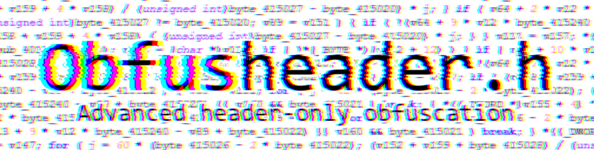
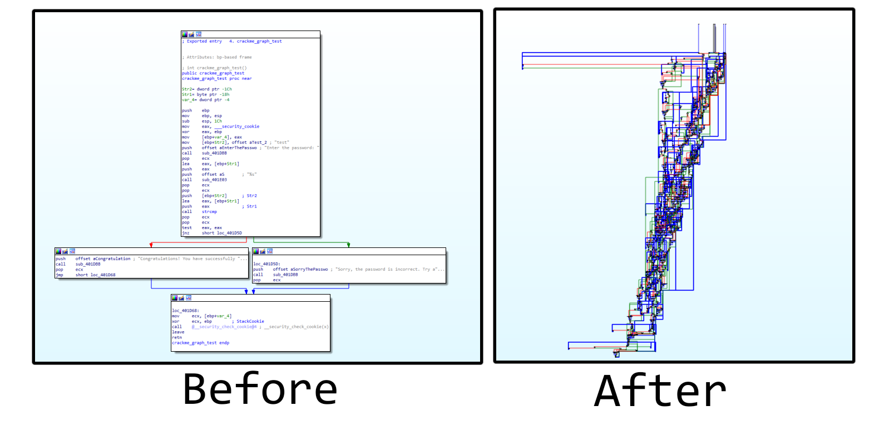
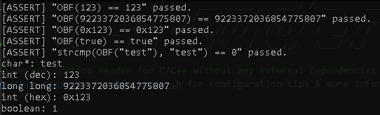
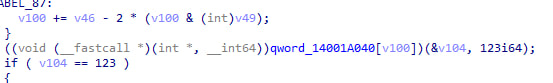
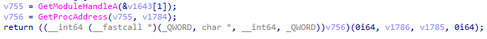
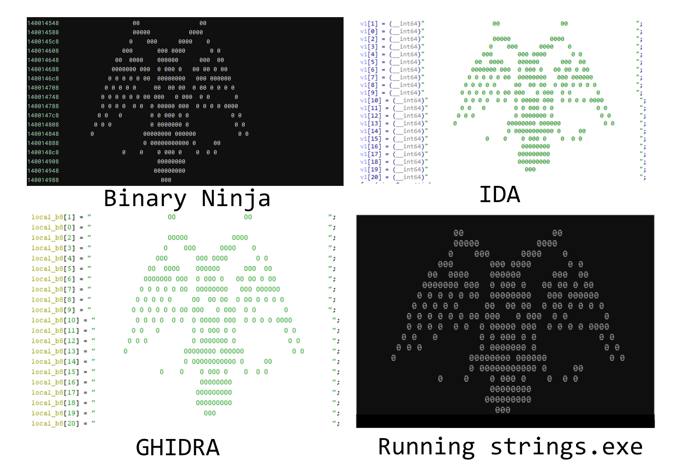
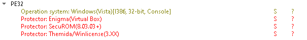
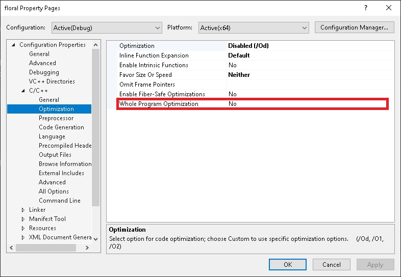

# Obfusheader.h
<div align=center style="background-color: transparent;">
    </img>
</div>

Obfusheader.h is a header-only library for C++14 and above, offering features like compile-time obfuscation using metaprogramming (string & decimal encryption, control flow, call hiding). It is self-contained, compatible with Windows and Unix, and supports g++, gcc, and Visual C++ compilers on various CPU architectures. This header simplifies adding basic protection to sensitive data in your binaries and supports g++ compilation arguments (-O3, Os, -fPIC, etc).

## 🛠️ Current features

<div align=center style="background-color: transparent;">
    </img>
    <text>Sample crackme with & without obfusheader.h</text>
</div>

### Obfuscation features
- Fully compile-time contant encryption (any types, including strings, decimals & chars) with two modes - threadlocal & normal and random key generation in compile-time)
- Call hiding (using compile-time function pointer array shuffling)
- Imports hiding (cross-platform via GetProcAddress on windows & dlsym on linux) with import name encryption
- if/else/while/for/switch compiletime branching mutation (inline control flow, branch redefinition)
- Purely compile-time random providers based on macro constants (\_\_TIME\_\_, \_\_LINE\_\_, \_\_COUNTER\_\_)
- Completely break decompiler such as IDA pro using unusual inline ASM blocks & indirect branching
- Watermarking & leaving fun messages for crackers in your binaries which will appear in decompiler and stack trace
- Fake signatures to trick DIE (Detect-It-Easy) and other detectors into thinking the binary is protected via VMProtect, Themida & other popular protectors

### Additional modules
- Fully inline internal implementation of common C methods such as strcmp, memcmp, strcmp, etc to avoid hooking & make reversing harder

## 📑 Usage

### Settings
You can change them in the start of **obfusheader.h**. This will affect how the obfuscation works in different ways. 

```c++
#pragma region CONFIG
    // C++ only features
    #define CONST_ENCRYPTION            1
    #define CONST_ENCRYPT_MODE          NORMAL // NORMAL & THREADLOCAL
    #define CFLOW_CONST_DECRYPTION      1
    // C & C++ features
    #define CFLOW_BRANCHING             0
    #define INDIRECT_BRANCHING          0
    #define FAKE_SIGNATURES             0
    #define INLINE_STD                  1
    #define KERNEL_MODE                 0
#pragma endregion CONFIG
```

### Compile-time constant encryption
You can encrypt strings and any xor-able decimals easily. The macro is universal - it accepts any supported type as an argument.
```c++
 printf("char*: %s\n"
        "int (dec): %d\n"
        "long long: %llu\n"
        "int (hex): 0x%x\n"
        "boolean: %d\n",
        OBF("test"), OBF(123),
        OBF(9223372036854775807),
        OBF(0x123), OBF(true));
```
The logic of the program won't be affected and the original values will be restored during runtime and **never present in the binary**.

⚠️ Note that obfusheader doesn't use dynamic allocations. All the decryption happens in stack memory and the returned values will be deallocated whenever you leave the scope.

```c++
// Not safe, since the string might get deallocated upon compiling with optimizations
const char* str = OBF("test");
printf("1: %s\n", str);

// Safe, since the string is passed directly inside the method and stack memory has 0 chances to get deallocated
printf("2: %s\n", OBF("test"));

// Safe, since we create the encrypted storager and decrypt the string only when required
auto obf = MAKEOBF("test");
printf("3: %s\n", (char*)obf);
```

<div align=center>
    <br/>
    <text>The logic isn't affected - the data is decrypted in runtime</text>
</div>

<br/>

### Call hiding
Obfusheader allows you to hide calls to any internal methods by generating randomly shuffled function pointer arrays in compiletime and obfuscating the origin index.

```c++
CALL(&printf, "Very secure call\n");
```

<div align=center>
    <br/>
    <text>Call hiding demo</text>
</div>
<br/>

### Import hiding
You can hide any calls exported from external libraries on both linux and windows. (I will port to PEB walking soon enough, stay tuned)

```c++
 if (CALL_EXPORT("kernel32.dll", "LoadLibraryA", int(*)(const char*), "user32.dll"))
                    CALL_EXPORT("user32.dll", "MessageBoxA", int(*)(int, const char*, const char*, int), 0, "Real", "Msgbox", 0);
```

<br/>
    <div align=center>
        <br/>
        <text>Import hiding demo</text>
    </div>
<br/>

### Binary watermarking
You can leave messages and ASCII arts in your binary which will not affect execution, but will be displayed in IDA/GHIDRA decompilers. To do that use the **WATERMARK** macro. Inspired by <a href="https://github.com/xoreaxeaxeax/REpsych">REpsych</a> and some java obfuscators which also do that.

```c++
WATERMARK("                                                           ",
          "                   00                 00                   ",
          "                   00000           0000                    ",
          "                  0    000      0000    0                  ",
          "                000       000 0000       0 0               ",
          "              00  0000    000000      000  00              ",
          "             0000000 000  0 000 0   00 00 0 00             ",
          "            0 0 0 0 0 00  00000000   000 000000            ",
          "           0 0 0 0 0     00  00 00  0 00 0 0 0 0           ",
          "          0 0 0 0 0 0 00 000   0 000  0 0       0          ",
          "          0 0 0 0  0 0  0 00000 000  0 0 0 0 0000          ",
          "         0 0   0        0 0 000 0 0            0 0         ",
          "        0 0 0           0 0000000 0             0 0        ",
          "       0              00000000 000000            0 0       ",
          "                      0 00000000000 0     00               ",
          "                0    0    0 000 0    0  0 0                ",
          "                          00000000                         ",
          "                         000000000                         ",
          "                         000000000                         ",
          "                           000                             ",
          "                                                           ");
```
<div align=center>
    <br/>
    <text>Watermarking in different RE tools</text>
</div>
<br/>

### Fake signatures

This is a windows-only (currently) feature, allowing to add fake detections to mimic powerful protections. First thing any reverse-engineer does is doing basic analysis on the binary via Detect-It-Easy, PeExeInfo or Nauz File detector. Fake signatures allow to trick crackers into thinking that the software was protected with multiple decent protectors and makes them doubt it's worth the time to reverse it.

<div align=center>
    <br/>
    <text>Detect-It-Easy output</text>
</div>
<br/>

⚠️ If you're using Visual C++ be sure to disable whole program optimization is the project properties. Otherwise the compiler won't create additional sections in the binary. 
<div align=center>
    <br/>
</div>
<br/>

### Additional features & modules
Obfusheader uses a few unique macroses which can be used in your programs. **RND(min, max)** can be used to generate random decimals in compiletime.

```c++
printf("Some random value: %d\n", RND(0, 10));
```
**INLINE** can be used to forcefully inline any method.
```c++
INLINE void do_something() {
	// the method will be fully inlined on any compiler
}
```

Also obfusheader reimplements most common C methods fully inlined, including: **strcpy, strlen, strncat, strcmp, strncmp, strstr**. You can use those methods to achieve more secure operations and prevent reversers from hooking their standard implementations.

```c++
if (inline_strcmp(password, correctPassword) == OBF(0)) {
    printf(OBF("Congratulations! You have successfully cracked the program. \n"));
} else {
    printf(OBF("Sorry, the password is incorrect. Try again!\n"));
}
```

## ⭐ Credits

Special thanks to these people: <a href="https://github.com/dosx-dev">DosX-dev</a>, <a href="https://github.com/ARandomPerson7">RandomPerson7</a> for suggestions & great ideas! Your help is greatly appreciated